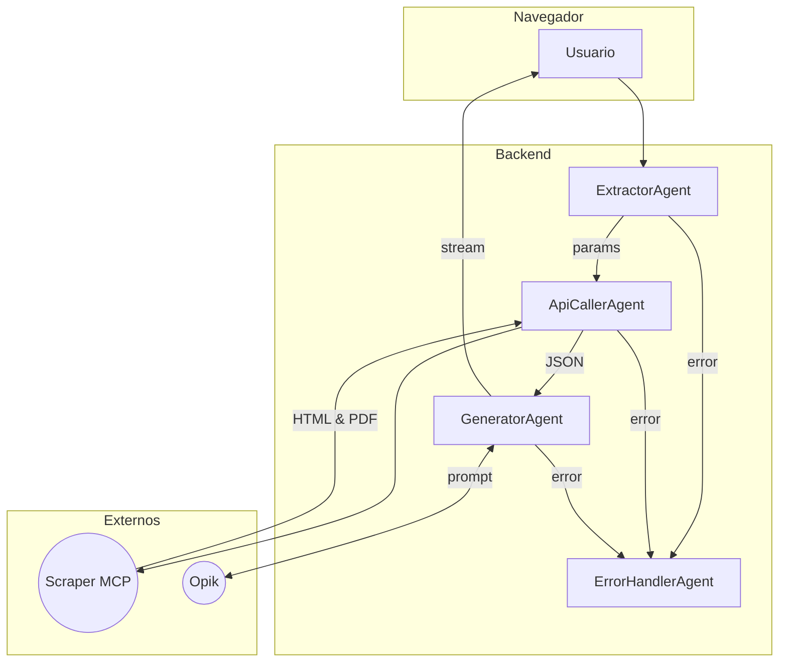
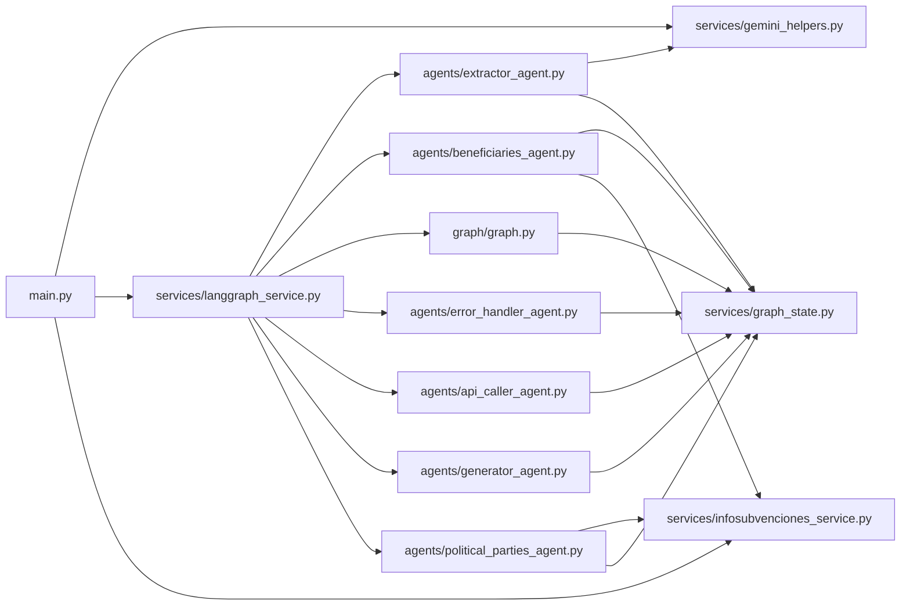

# Buscador de Subvenciones · **Orellana**


> **Orellana** es una aplicación web de _chat conversacional_ capaz de buscar, enriquecer y resumir **subvenciones públicas** del sistema InfoSubvenciones (España).  
> Combina **Flask** + **LangGraph** + **LLM agents** (Gemini / OpenAI) y gestiona los _prompts_ de manera centralizada mediante **Opik**.

---

## Índice

1. [Características](#características)  
2. [Instalación rápida](#instalación-rápida)  
3. [Variables de entorno](#variables-de-entorno)  
4. [Estructura de directorios](#estructura-de-directorios)  
5. [Arquitectura de alto nivel](#arquitectura-de-alto-nivel)  
6. [Componentes principales](#componentes-principales)  
7. [Ejecución de tests](#ejecución-de-tests)  
8. [Licencia](#licencia)  
9. [Relaciones entre ficheros `.py`](#relaciones-entre-ficheros-py)  

---

## Características

| Categoría                | Detalle                                                     |
|--------------------------|-------------------------------------------------------------|
| **Back-end**            | Python 3.10+, **Flask**                                      |
| **Orquestación**        | **LangGraph** (grafos dirigidos condicionales)               |
| **LLM**                 | Google **Gemini** + **OpenAI** (selección dinámica)          |
| **Gestión de prompts**  | **Opik** – versionado y _observability_                      |
| **Frontend**            | HTML + CSS + JS nativo (SSE para _streaming_)                |
| **Micro-servicios**     | Scraper FastAPI (`info_convocatoria_mcp.py`)                 |
| **CI**                  | GitHub Actions (lint + tests)                                |
| **Tests**               | `pytest` + `pytest-asyncio`                                  |

---

## Instalación rápida

```bash
git clone https://github.com/tu-org/buscador_subvenciones.git
cd buscador_subvenciones_codigo

# Crea y activa un venv (opcional)
python -m venv .venv
source .venv/bin/activate      # Windows: .venv\Scripts\activate

pip install -r requirements.txt

# Copia .env de ejemplo y añade tus credenciales
cp .env.example .env
vim .env                        # o tu editor favorito

# Inicia la API de scraping en otra terminal (opcional pero recomendado)
python src/mcp/info_convocatoria_mcp.py &

# Lanza la aplicación
python src/main.py
```

La aplicación quedará accesible en [http://localhost:5000](http://localhost:5000) (puerto configurable vía `PORT`).

---

## Variables de entorno

| Variable         | Descripción                          | Obligatoria | Ejemplo               |
| ---------------- | ------------------------------------ | ----------- | --------------------- |
| `GEMINI_API_KEY` | Clave de la API de Gemini            | ✔️          | `AIza...`             |
| `OPENAI_API_KEY` | Clave de la API de OpenAI (opcional) | ❌           | `sk-...`              |
| `OPIK_API_KEY`   | Token de acceso a Opik               | ✔️          | `opk_xxx`             |
| `OPIK_API_URL`   | URL base de la API de Opik           | ❌           | `https://api.opik.ai` |
| `FLASK_DEBUG`    | Activa modo debug (`0`/`1`)          | ❌           | `1`                   |
| `PORT`           | Puerto HTTP de Flask                 | ❌           | `5000`                |

> **Tip**: guarda todas las variables en un fichero `.env`; se cargarán automáticamente mediante **python-dotenv**.

---

## Estructura de directorios

```text
buscador_subvenciones_codigo/
├── .env.example
├── requirements.txt
├── prompts/                    # Plantillas locales de respaldo
├── src/
│   ├── main.py                 # Entrypoint Flask
│   ├── agents/                 # Agentes LLM
│   ├── graph/                  # Grafo LangGraph
│   ├── services/               # Servicios auxiliares
│   ├── mcp/                    # Micro-servicios externos
│   ├── templates/              # Jinja2 templates
│   └── static/                 # CSS / JS / imágenes
├── test/                       # Tests
└── media/                      # Recursos estáticos
```

## Arquitectura de alto nivel

1. **Frontend** envía la consulta del usuario (`/api/chat`).
2. `main.py` crea un **`GraphState`** con la conversación actual.
3. **LangGraph** enrutará la petición por distintos agentes:

   * **ExtractorAgent** → detecta intención y parámetros.
   * **ApiCallerAgent** → conecta con InfoSubvenciones y el micro-servicio de scraping.
   * **GeneratorAgent** → produce la respuesta final *streaming*.
4. **Opik** provee el prompt óptimo para cada agente.
5. La respuesta se devuelve al navegador mediante **Server-Sent Events (SSE)**.



## Componentes principales

| Archivo / Ruta                             | Rol                                       |
| ------------------------------------------ | ----------------------------------------- |
| `src/main.py`                              | Servidor Flask + endpoints REST/SSE       |
| `src/graph/graph.py`                       | Grafo de conversación (LangGraph)         |
| `src/services/langgraph_service.py`        | Orquestador que monta y ejecuta el grafo  |
| `src/services/infosubvenciones_service.py` | Cliente para la API InfoSubvenciones      |
| `src/services/gemini_helpers.py`           | Abstracciones Gemini (modelos, streaming) |
| `src/agents/*_agent.py`                    | Agentes especializados                    |
| `src/mcp/info_convocatoria_mcp.py`         | Micro-servicio FastAPI (scraping)         |
| `src/services/graph_state.py`              | Dataclass compartido entre nodos          |

---

## Ejecución de tests

```bash
pytest -q
```

---

## Licencia

Distribuido bajo la licencia [MIT](LICENSE).

---

## Relaciones entre ficheros `.py`

El siguiente diagrama muestra las **dependencias de importación internas** entre los principales módulos del proyecto:


