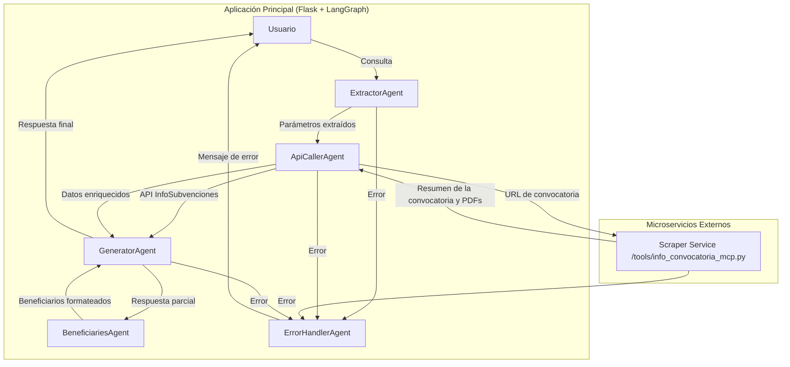

# Buscador de Subvenciones (Orellana)

<div style="text-align: center;">
  
</div>

Orellana es una **aplicación web** de chat conversacional para buscar información sobre subvenciones (convocatorias, beneficiarios, etc.) en España usando servicios de IA y una arquitectura basada en grafos.

## 📋 Descripción

- **Lenguaje**: Python 3.10+
- **Framework Web**: Flask
- **Motor de IA**: Gemini (a través de `langgraph`) y OpenAI
- **Arquitectura**: Orquestador basado en grafos (LangGraph) con agentes especializados y microservicios (MCP).
- **Frontend**: HTML/CSS/JS mínimo, sin frameworks de JS

El objetivo es proporcionar una interfaz de chat donde el usuario haga consultas en lenguaje natural y obtenga respuestas detalladas sobre subvenciones, parámetros de búsqueda, detalles de convocatoria y listados de beneficiarios.

---

## 🔧 Requisitos

- Python 3.10 o superior
- Acceso a la API de InfoSubvenciones (URL y credenciales en `.env`)
- Claves de API de IA (configuración en `.env`)

Instalación de dependencias:
```bash
pip install -r requirements.txt
```

## ⚙️ Configuración

1. Copiar `.env.example` a `.env`:
   ```bash
   cp .env.example .env
   ```
2. Rellenar variables en `.env`:
   ```dotenv
   PORT=5000
   FLASK_DEBUG=True
   INFOSUBVENCIONES_API_URL=https://api.infosubvenciones.gob.es
   INFOSUBVENCIONES_API_KEY=TU_API_KEY
   GEMINI_API_KEY=TU_API_KEY_GEMINI
   GEMINI_MODEL=gemini-1.5-flash # O el modelo que desees usar
   ```

---

## 📂 Estructura de Directorios

```text
buscador_subvenciones_codigo/
├─ .env
├─ requirements.txt
├─ prompts/                   # Plantillas para llamadas a modelos de IA
│  ├─ ... (prompts)
├─ src/
│  ├─ main.py                # Entrada de la aplicación Flask
│  ├─ agents/                # Agentes LLM: extracción, API, generación, errores
│  ├─ services/              # Servicios: llamadas a API, estado de grafo, helpers
│  ├─ graph/                 # Definición de grafo de flujo de trabajo con LangGraph
│  ├─ templates/
│  │   └─ index.html         # Plantilla de la interfaz de usuario
│  └─ static/
│      ├─ css/styles.css
│      └─ js/main.js
├─ tools/                     # Herramientas y microservicios externos
│  └─ info_convocatoria_mcp.py # Servidor MCP para scraping y resumen de convocatorias
```

---

## 🏛️ Arquitectura & Flujo de Ejecución

1.  **Usuario** accede a la ruta `/` y carga `index.html`, que inicializa el chat.
2.  El cliente JS envía la consulta al endpoint `/api/chat` vía `fetch`.
3.  En `main.py`, se crea un objeto `GraphState` con la consulta original y el historial.
4.  Se construye el **grafo de flujo** definido en `src/graph/graph.py`:
    -   Nodos de **determinación de intención** y **extracción de parámetros**.
    -   Nodos de **llamada a APIs** (`infosubvenciones_service`) y **herramientas externas**, como el microservicio de scraping (`info_convocatoria_mcp.py`).
    -   Nodos de **generación de respuestas** con IA.
    -   Nodos de **manejo de errores**.
5.  El grafo evalúa condiciones en cada arista para decidir la siguiente acción.
6.  Los **Agentes** (`src/agents/*.py`) ejecutan las tareas correspondientes.
7.  Si se necesita información de una URL externa (p. ej., el detalle de una convocatoria), un agente puede invocar a la herramienta **`info_convocatoria_mcp.py`**, que se ejecuta como un servidor independiente.
8.  El resultado final es **streamed** al cliente, que renderiza los mensajes en la interfaz.

---

## 🛠️ Detalle de Componentes

A continuación se describen con más detalle los principales ficheros Python del proyecto.

### 1. `src/main.py` (Aplicación Flask)
- **Punto de entrada** de la aplicación web principal.
- Define la ruta `/api/chat` que recibe las consultas del usuario e invoca el grafo de LangGraph para procesarlas.
- Gestiona el streaming de la respuesta de vuelta al cliente.

---

### 2. Agentes (`src/agents/*.py`)
Cada agente es una clase con un método `run` que modifica el estado del grafo.
-   **ExtractorAgent**: Extrae parámetros (años, IDs) de la consulta del usuario.
-   **ApiCallerAgent**: Realiza llamadas a APIs externas, como InfoSubvenciones o el microservicio de scraping.
-   **GeneratorAgent**: Genera la respuesta en lenguaje natural usando un LLM.
-   **BeneficiariesAgent**: Formatea listas de beneficiarios.
-   **ErrorHandlerAgent**: Gestiona excepciones y errores durante la ejecución.

---

### 3. Servicios (`src/services/*.py`)
-   **`infosubvenciones_service.py`**: Encapsula la lógica para interactuar con la API de InfoSubvenciones.
-   **`langgraph_service.py`**: Orquesta la ejecución del grafo definido con LangGraph.
-   **`graph_state.py`**: Define la estructura de datos (`GraphState`) que fluye a través del grafo.
-   **`gemini_helpers.py`**: Funciones auxiliares para interactuar con la API de Gemini.

---

### 4. Grafo de Conversación (`src/graph/graph.py`)
- Define la lógica de control del chatbot.
- Conecta los agentes mediante nodos y aristas condicionales para crear flujos de conversación complejos y adaptativos.

---

### 5. Frontend (`src/templates` y `src/static`)
- Contiene el código HTML, CSS y JavaScript para la interfaz de chat del usuario.
- Se comunica con el backend a través de peticiones `fetch` y maneja respuestas en streaming (Server-Sent Events).

---

### 6. Herramienta de Scraping (`tools/info_convocatoria_mcp.py`)
Este script funciona como un **microservicio independiente** para extraer y resumir información detallada de páginas de convocatorias.

-   **Tecnología**: Se basa en `FastMCP` para crear un servidor de herramientas ligero.
-   **Propósito**: Ofrecer una función (`get_info_convo`) que, dada una URL, extrae no solo el contenido de la página, sino también el texto de cualquier documento PDF enlazado.
-   **Flujo de trabajo interno**:
    1.  Recibe una URL.
    2.  Utiliza `requests` y `BeautifulSoup` para descargar y parsear el HTML de la página.
    3.  Identifica todos los enlaces que apuntan a ficheros PDF.
    4.  Descarga cada PDF y extrae su contenido de texto usando `PyPDF2`.
    5.  Combina el texto de la página web y el de los PDFs en un único documento.
    6.  Envía este documento combinado al modelo de Gemini (`summarise_via_llm`) para obtener un resumen conciso.
    7.  Devuelve el resumen como resultado.
-   **Ejecución**: Se debe ejecutar en un terminal separado para que esté disponible para la aplicación principal.
    ```bash
    python tools/info_convocatoria_mcp.py
    ```

---

## 📈 Organigrama de la Organización de Agentes

El siguiente diagrama muestra el flujo de datos y la interacción entre los componentes clave del sistema, incluyendo la nueva herramienta de scraping.

