# Buscador de Subvenciones (Orellana)

<div style="text-align: center;">
  
</div>

Orellana es una **aplicación web** de chat conversacional para buscar información sobre subvenciones (convocatorias, beneficiarios, etc.) en España usando servicios de IA y una arquitectura basada en grafos.

## 📋 Descripción

- **Lenguaje**: Python 3.10+
- **Framework Web**: Flask
- **Motor de IA**: Gemini (a través de `langgraph`) y OpenAI
- **Arquitectura**: Orquestador basado en grafos (LangGraph) con agentes especializados
- **Frontend**: HTML/CSS/JS mínimo, sin frameworks de JS

El objetivo es proporcionar una interfaz de chat donde el usuario haga consultas en lenguaje natural y obtenga respuestas detalladas sobre subvenciones, parámetros de búsqueda, detalles de convocatoria y listados de beneficiarios.

---

## 🔧 Requisitos

- Python 3.10 o superior
- Acceso a la API de InfoSubvenciones (URL y credenciales en `.env`)
- Claves de API de IA (configuración en `.env`)

Instalación de dependencias:
```bash
pip install -r requirements.txt
```


## ⚙️ Configuración

1. Copiar `.env.example` a `.env`:
   ```bash
   cp .env .env.example
   ```
2. Rellenar variables en `.env`:
   ```dotenv
   PORT=5000
   FLASK_DEBUG=True
   INFOSUBVENCIONES_API_URL=https://api.infosubvenciones.gob.es
   INFOSUBVENCIONES_API_KEY=TU_API_KEY
   GEMINI_API_KEY=TU_API_KEY_GEMINI
   ```

---

## 📂 Estructura de Directorios

```text
buscador_subvenciones_codigo/
├─ .env
├─ requirements.txt
├─ prompts/                   # Plantillas para llamadas a modelos de IA
│  ├─ orchestrator_prompt.txt
│  ├─ extract_params_prompt.txt
│  ├─ extract_years_prompt.txt
│  ├─ convocatoria_extractor_prompt.txt
│  ├─ generate_search_summary_prompt.txt
│  ├─ generate_beneficiaries_summary_prompt.txt
│  ├─ generate_general_response_prompt.txt
│  └─ generate_detailed_response_prompt.txt
├─ src/
│  ├─ main.py                # Entrada de la aplicación Flask
│  ├─ agents/                # Agentes LLM: extracción, API, generación, errores
│  ├─ services/              # Servicios: llamadas a API, estado de grafo, helpers
│  ├─ graph/                 # Definición de grafo de flujo de trabajo con LangGraph
│  ├─ templates/
│  │   └─ index.html         # Plantilla de la interfaz de usuario
│  └─ static/
│      ├─ css/styles.css     # Estilos básicos
│      └─ js/main.js         # Lógica frontend: envío y renderizado de mensajes
```

---

## 🏛️ Arquitectura & Flujo de Ejecución

1. **Usuario** accede a la ruta `/` y carga `index.html`, que inicializa el chat.
2. El cliente JS envía la consulta al endpoint `/api/chat` vía `fetch`.
3. En `main.py`, se crea un objeto `GraphState` con la consulta original y el historial.
4. Se construye el **grafo de flujo** definido en `src/graph/graph.py`:
   - Nodos de **determinación de intención** y **extracción de parámetros** (años, IDs de convocatoria, filtros).
   - Nodos de **llamada a APIs** (`infosubvenciones_service`, `api_caller_agent`).
   - Nodos de **generación de respuestas** (resúmenes de búsqueda, respuestas generales, respuestas detalladas, beneficiarios) mediante plantillas de prompts.
   - Nodos de **manejo de errores**.
5. El grafo evalúa condiciones en cada arista para decidir la siguiente acción:
   - `should_extract` → extracción de parámetros si faltan.
   - `should_call_api` → invocar servicio externo.
   - `should_generate_response` → formatear la respuesta con IA.
6. Los **Agentes** (`src/agents/*.py`):
   - **ExtractorAgent**: extrae parámetros via LLM.
   - **ApiCallerAgent**: realiza llamadas HTTP (InfoSubvenciones).
   - **GeneratorAgent**: genera texto de respuesta con LLM.
   - **BeneficiariesAgent**: formatea lista de beneficiarios.
   - **ErrorHandlerAgent**: captura errores y genera mensajes de usuario.
7. El resultado final es **streamed** al cliente (soporte de streaming en `Response(stream_with_context)`), o como texto completo.
8. El frontend renderiza los mensajes en la interfaz de chat.

---

## 🛠️ Detalle de Componentes

A continuación se describen con más detalle los principales ficheros Python del proyecto, su estructura interna, clases, funciones y flujo de datos.

### 1. `src/main.py`
- **Punto de entrada** de la aplicación Flask.
- **Importaciones clave**:
  ```python
  from flask import Flask, request, Response, render_template
  from services.langgraph_service import LangGraphService
  from graph.graph import build_conversation_graph
  ```
- **Flask app**:
  ```python
  app = Flask(__name__)
  ```
- **Rutas**:
  - `@app.route('/')`: Renderiza `index.html`.
  - `@app.route('/api/chat', methods=['POST'])`: Recibe JSON `{"message": str}`, carga el historial, construye un grafo vía `build_conversation_graph()`, instancia `LangGraphService` y ejecuta el grafo para generar stream de tokens.
- **Streaming**:
  ```python
  def stream_response(graph_state):
      for chunk in graph_service.execute(graph_state):
          yield chunk
  ```
  Devuelve una respuesta con `Response(stream_with_context(stream_response(state)), mimetype='text/event-stream')`.

---

### 2. Agentes (`src/agents/*.py`)
Cada agente implementa una clase con método `run(self, state: GraphState) -> GraphState`, recibiendo y devolviendo el estado actualizado.

#### a) `extractor_agent.py`
- **Clase**: `ExtractorAgent`
- **Función principal**: extraer parámetros de la consulta (años, IDs de convocatoria, filtros) usando LLM.
- **Método**: `run(self, state)`:
  1. Prepara prompt basado en plantilla `extract_params_prompt.txt`.
  2. Llama a `llm.generate(prompt)` (puede ser Gemini u OpenAI según configuración).
  3. Parsea la salida JSON con `json.loads(...)` para actualizar `state.params`.

#### b) `api_caller_agent.py`
- **Clase**: `ApiCallerAgent`
- **Objetivo**: Invocar servicios HTTP y adjuntar resultados en `state.api_response`.
- **Método**: `run(self, state)`:
  1. Lee `state.params` (e.g. `year`, `convocatoria_id`).
  2. Construye URL y cabeceras usando `infosubvenciones_service`.
  3. Ejecuta `requests.get` o `post`, maneja timeouts y errores.
  4. Guarda la respuesta JSON en `state.api_response`.

#### c) `generator_agent.py`
- **Clase**: `GeneratorAgent`
- **Función**: Generar la respuesta de usuario en lenguaje natural.
- **Método**: `run(self, state)`:
  1. Selecciona plantilla adecuada (`generate_search_summary_prompt.txt`, `generate_detailed_response_prompt.txt`, etc.) según la fase.
  2. Incorpora `state.api_response` y `state.history` en el prompt.
  3. Llama a `llm.stream_generate` para emitir tokens en streaming.

#### d) `beneficiaries_agent.py`
- **Clase**: `BeneficiariesAgent`
- **Propósito**: Formatear la lista de beneficiarios.
- **Método**: `run(self, state)`:
  1. Recorre `state.api_response["beneficiarios"]`.
  2. Crea strings legibles: "Juan Pérez (cif: X), 50.000€"
  3. Concatena en un bloque Markdown si se usa streaming.

#### e) `error_handler_agent.py`
- **Clase**: `ErrorHandlerAgent`
- **Objetivo**: Capturar excepciones y producir mensajes claros.
- **Método**: `run(self, state)`:
  1. Detecta `state.error` (excepción de red, JSON mal formado).
  2. Genera mensaje con plantilla simple: "Lo siento, ha ocurrido un error interno: {detalle}".

---

### 3. Servicios (`src/services/*.py`)
Servicios encapsulan lógica de bajo nivel y helpers.

#### a) `infosubvenciones_service.py`
- **Clase**: `InfoSubvencionesClient`
- **Responsabilidades**:
  - Construir endpoints (e.g. `/convocatorias?year=2023`).
  - Añadir API key en headers.
  - Funciones públicas:
    ```python
    def get_convocatorias(self, year: int) -> dict: ...
    def get_convocatoria_details(self, id: str) -> dict: ...
    def get_beneficiarios(self, convocatoria_id: str) -> dict: ...
    ```

#### b) `langgraph_service.py`
- **Clase**: `LangGraphService`
- **Método**: `execute(self, state: GraphState) -> Iterator[str]`.
  1. Instancia el grafo con `state` y nodos.
  2. Itera sobre nodos activos, llamando a `agent.run(state)`.
  3. Sigue aristas según condiciones.
  4. Cada vez que un `GeneratorAgent` emita tokens, los yield.

#### c) `graph_state.py`
- **Clase**: `GraphState`
- **Atributos**:
  - `history: List[Dict]` (turnos de chat)
  - `params: Dict[str, Any]` (años, filtros, ids)
  - `api_response: Optional[Dict]`
  - `error: Optional[Exception]`
- **Métodos auxiliares**:
  - `add_message(role: str, content: str)`
  - `set_error(exc: Exception)`

#### d) `gemini_helpers.py`
- **Funciones**:
  - `configure_llm(api_key: str) -> LLMClient`
  - `stream_llm(prompt: str) -> Iterator[str]`
  - Traducción de responses chunked de Gemini al formato esperado.

---

### 4. Grafo de Conversación (`src/graph/graph.py`)
- **Función**: `build_conversation_graph() -> StateGraph`
- **Definición**:
  1. **Nodos**: Instancias de los Agentes.
  2. **Aristas**: Condiciones lambda sobre `graph_state`; p.ej.:
     ```python
     graph.add_edge(extractor, api_caller, condition=lambda s: not s.params)
     graph.add_edge(api_caller, generator, condition=lambda s: s.api_response)
     ```
  3. **Estado inicial**: `GraphState` con mensaje del usuario.
- **Evaluación**: El grafo avanza hasta un nodo `StopNode` tras emitir la respuesta.

---

### 5. Frontend (mínimo JS/Python)
- **`src/templates/index.html`**: Contiene un `<div id="chat">` y un `<form>` para enviar mensajes.
- **`src/static/js/main.js`**:
  1. Captura evento `submit`.
  2. Envía `fetch('/api/chat', { body: JSON.stringify({message}), headers: {'Content-Type':'application/json'} })`.
  3. Lee `response.body` como stream, parsea eventos SSE (EventSource).
  4. Actualiza el DOM con cada fragmento.

---

## 📈 Organigrama de la Organización de Agentes

A continuación se representa el flujo y las relaciones jerárquicas entre los agentes que conforman el orquestador basado en grafos. Usamos una notación tipo Mermaid para visualizar los nodos y sus conexiones:

```mermaid
graph TD
    U[Usuario]
    E[ExtractorAgent]
    A[ApiCallerAgent]
    B[BeneficiariesAgent]
    G[GeneratorAgent]
    H[ErrorHandlerAgent]

    U --> E
    E -->|params extraídos| A
    A -->|api_response| G
    G -->|respuesta parcial| B
    B -->|beneficiarios formateados| G
    G --> U

    %% Ruta de errores
    E -->|error detectado| H
    A -->|error HTTP| H
    G -->|error generación| H
    H --> U
```



